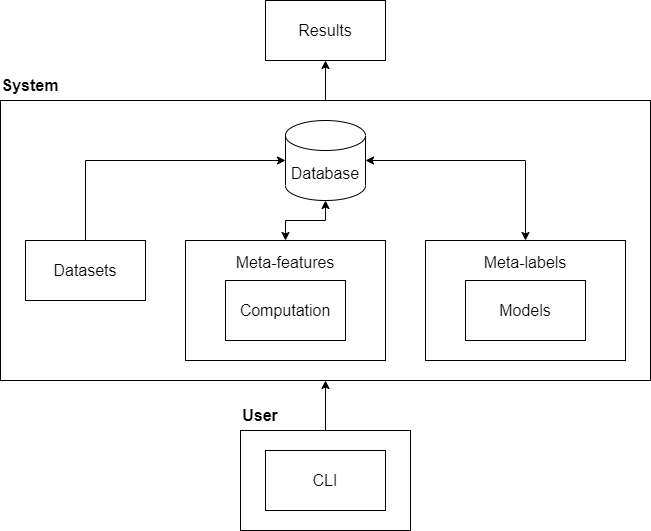

# Meta-Learning System

- [1. Objectives](#1-objectives)
- [2. Run system](#2-run-system)
- [3. Run user CLI](#3-run-user-cli)
  - [3.1. Datasets](#31-datasets)
  - [3.2. Meta-data](#32-meta-data)
  - [3.3. Miscellaneous](#33-miscellaneous)
- [4. Architecture](#4-architecture)
- [5. Libraries](#5-libraries)

## 1. Objectives

1. Collect datasets from available repositories (e.g. UCL) to form a dataset collection.
2. Generate meta-data (meta-features and meta-labels) for each dataset in the dataset collection.
3. Visualise accuracy space between kNN and decision tree.

## 2. Run system

`python -m meta_learning_system.system.main`

## 3. Run user CLI

**NOTE**: Prefix all commands with `python -m meta_learning_system.user.cli.main`. (A Python package needs to be built to remove this requirement.)

**TIP**: `--help` option is available for any commands. (Try `python -m meta_learning_system.user.cli.main --help`.)

### 3.1. Datasets

1. `dataset list` - list all datasets
2. `dataset add name info file source` - add a dataset
3. `dataset delete name` - delete a dataset

### 3.2. Meta-data

1. `metafeature generate` - generate meta-features
2. `metalabel generate` - generate meta-labels

### 3.3. Miscellaneous

1. `exit` - exit CLI

## 4. Architecture

## 5. Libraries

**NOTE**: The list of libraries used in this project is not exhaustive. Only important ones are listed.

1. numpy
2. scipy
3. sklearn
4. skopt
5. typer
